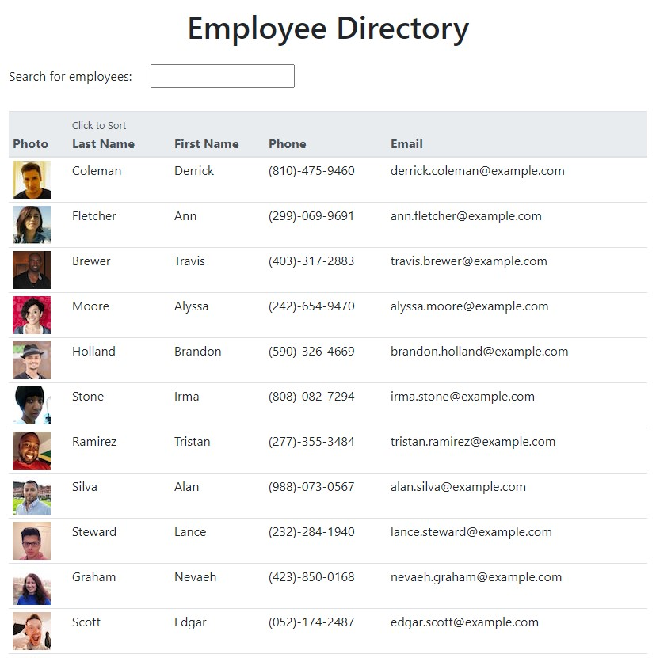

# Employee Directory
Deployed app: http://cmetzjr.github.io/employee-directory-react

## Description
This is an application that lets you view employees. You can sort and search them by last name.

## Table of Contents
* [Installation](#Installation)
* [Application use](#Usage)
* [Contribution Guidelines](#Contribution)
* [Tests](#Tests)
* [License](#License)
* [Questions](#Questions)

## Installation
This is a deployed application, so no installation is required.

## Usage
Upon loading the application, the employee list is populated. Click on the "Last Name" column header to sort alphabetically or reverse-alphabetically. Use the search box to find employees by last name.

Screenshot of the application: 

## Contribution
Submit bug and feature requests as issues through the GitHub repo.

## Tests
None

## License
This app can be used under the terms of the MIT license.

## Questions
For questions, please contact <cmetzjr@yahoo.com>. 
GitHub repo: https://github.com/cmetzjr/employee-directory-react
